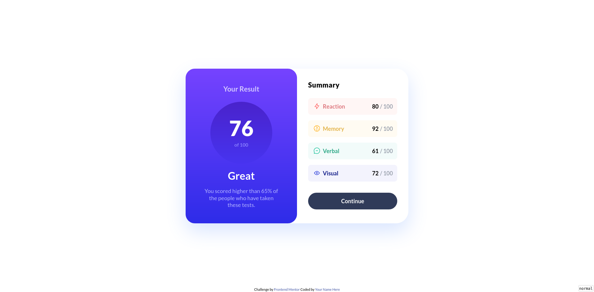

# Frontend Mentor - Results summary component solution

This is a solution to the [Results summary component challenge on Frontend Mentor](https://www.frontendmentor.io/challenges/results-summary-component-CE_K6s0maV). Frontend Mentor challenges help you improve your coding skills by building realistic projects. 

## Table of contents

- [Overview](#overview)
  - [The challenge](#the-challenge)
  - [Screenshot](#screenshot)
  - [Links](#links)
- [My process](#my-process)
  - [Built with](#built-with)
  - [What I learned](#what-i-learned)
  - [Continued development](#continued-development)
  - [Useful resources](#useful-resources)
- [Author](#author)
- [Acknowledgments](#acknowledgments)

**Note: Delete this note and update the table of contents based on what sections you keep.**

## Overview

### The challenge

Users should be able to:

- View the optimal layout for the interface depending on their device's screen size
- See hover and focus states for all interactive elements on the page

### Screenshot

### Links

- [Solution URL](https://www.frontendmentor.io/solutions/responsive-by-tailwindcss-on-vite-with-scalajs-and-laminar-LL-c2qJqFG)
- [Live Site URL](https://efim-frontendmentor-results-summary-component-exercise.pages.dev/)

## My process

### Built with

- Semantic HTML5 markup
- TailwindCSS
- Flexbox
- Mobile-first workflow
- ScalaJS
- Laminar
- Vite

### What I learned

#### practiced joining Scala sbt project

with Vite created JS Vanilla and TailwindCSS.
( as step 0 i probably want a nix shell with sbt, npm, scalafmt )
1. start Vite project
   https://www.scala-js.org/doc/tutorial/scalajs-vite.html
   npm create vite
   Vanilla > Javascript
2. copy to directory up, if i already created a directory
3. install js dependencies:
   npm install
4. add build.sbt \ properties \ and basic .scala files
5. install scalajs-vite plugin, fix imports in main.js
6. adding Laminar dependencies and changing main file
   https://www.scala-js.org/doc/tutorial/laminar.html
7. install tailwindcss and add a couple of classes to check that it works
   https://tailwindcss.com/docs/guides/vite
   
#### incorporated svg image (in a wrong way)

By using [Laminext](https://laminext.dev/v/0.15.x/fetch) (extension library to Laminar with FetchApi \ websocket \ validation integrations) to download image

    val svgRaw = Fetch.get(result.iconPath).text.map(_.data)
    def loadingDiv = div(className := "lds-dual-ring")
    val svgIcon = svgRaw
      .map(str =>
        foreignSvgElement(DomApi.unsafeParseSvgString(str))
          .amend(svg.className := "justify-self-center w-4 h-4 lg:w-5 lg:h-5")
      )
      .startWith(loadingDiv)

### Continued development

- In future projects I'd like to test out more complex logic via Observable, Signal.
- Would like to practice with draggable elements and other things for which I'd need JS libraries.
- Would like to test webcomponents

### Useful resources

- [Instruction to set up ScalaJS](https://www.scala-js.org/doc/tutorial/scalajs-vite.html) 
- [Instruction to set up Laminar](https://www.scala-js.org/doc/tutorial/laminar.html) - This is an amazing article which helped me finally understand XYZ. I'd recommend it to anyone still learning this concept.
- [Laminar Documentation](https://laminar.dev/documentation)
- [TailwindCSS Documentation](https://tailwindcss.com/docs)

